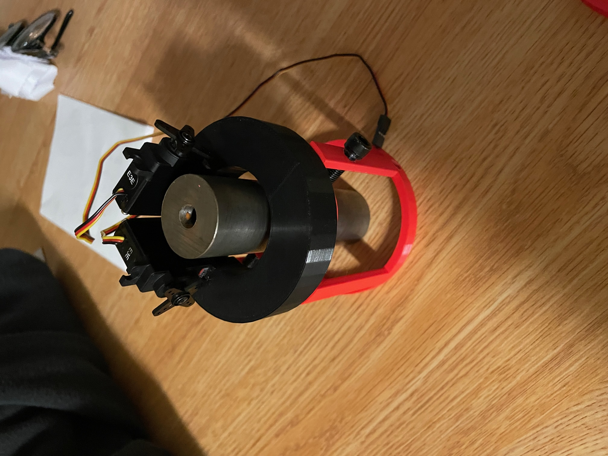

# **Matthew Chen Aerospace Engineering**
## About Me:
  I'm Matthew, a 1st year aerospace engineer at UCSD highly passionate about rocketry and mechatronics projects!
  [Resume](https://docs.google.com/document/d/1zDOzf1gchhaheLNwPMjJaL7LEOK11CnDcCoudadRoXM/edit?usp=sharing)
## Contacts: 
  [Email](mailto:mac032@ucsd.edu)

  [LinkedIn](https://www.linkedin.com/in/matthew-chen-5aa403243/)

# Rocketry

### OOGASTEERS (thrust-vectoring rocket)
#### Overview:
Thrust-vectoring rocket using PID and data filtering(E) to control pitch and yaw.

#### Skills used:
CAD (NX, Fusion360), PCB Design (Fusion360), 
Metal lathing/milling, Arduino, OpenRocket
Eventually (E): Matlab, Simulink

### Project Steps
Flew OOGA360 to test and model data from accelerometers, gyroscopes, and altimeters
### OOGA360 (1st model rocket)
